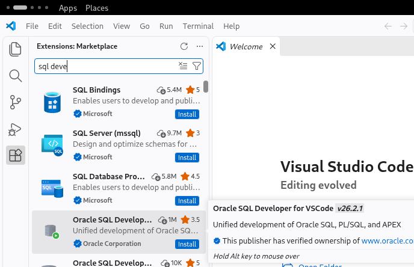
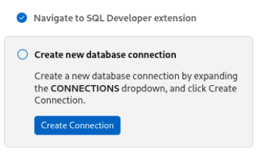
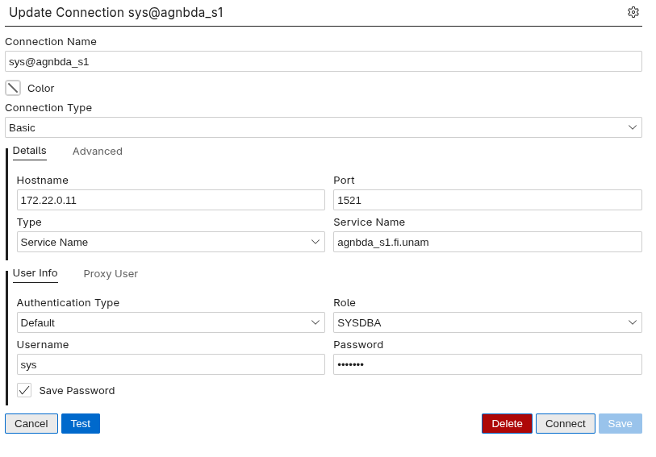
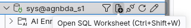
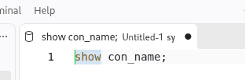
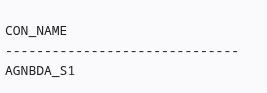

# BDA-P03

# En el HOST

## 01-crea-red-docker.sh

En el host ejecutar

```shellsession
martin@pc-bdx-mqr:/unam/bda/practicas/03/host$ sh 01-crea-red-docker.sh 
```

## 02-crea-contenedor.sh

En el host ejecutar

```shellsession
martin@pc-bdx-mqr:/unam/bda/practicas/03/host$ sh 02-crea-contenedor.sh
```

#### Agregar los alias de acceso rápido al contenedor

De manera **manual**

agregar en .bashrc el usuario **/home/alicia/.bashrc**

```bash
alias dockerBda1='docker start c1-bda-agn && docker attach c1-bda-agn'​
alias dockerBda1T='docker exec -it c1-bda-agn bash'
```


# En el Container

## 03-permisos-variables-ROOT.sh

En el contenedor como root ( su -l root pra cargar variables de entorno ) ejecurar

```shellsession
[root@h1-bda-agn container]# sh 03-permisos-variables-ROOT.sh 
```

## 04-crea-listener-ORACLE.sh

En el contenedor como oracle ejecutar

```shellsession
[oracle@h1-bda-agn container]$ sh 04-crea-listener-ORACLE.sh 
```

## 05-crea-cdb-silent-ORACLE.sh

En el contenedor como oracle  ejecutar

```shellsession
[oracle@h1-bda-agn container]$ sh 04-crea-listener-ORACLE.sh 
```

## 06-conf-ambiente-bd-ORACLE.sh

En el contenedor como oracle ejecutar

```shellsession
[oracle@h1-bda-agn container]$ sh 06-conf-ambiente-bd-ORACLE.sh 
```

## 07-alias-tnsnames-ROOT.sh

En el contenedor como root ejecutar

```shellsession
[root@h1-bda-agn container]# sh 07-alias-tnsnames-ROOT.sh 
```

# Script para levantar rápido la instancia de BD y el Listener

Tomado del profesor

darle privilegios de ejecución

y con **sudo** copiarlo/moverlo a **/usr/bin** preferiblemente sin extensión asi **/usr/bin/launch**

```shellsession
[martin@h1-bda-mqr container]$ sudo mv launch.sh /usr/bin/launch
[martin@h1-bda-mqr container]$ chmod +x /usr/bin/launch
```

Uso: 

Después de lanzar el contenedor

```shellsession
martin@pc-bdx-mqr:/unam/bda/practicas/03/container$ agnDockerBda1
```

ejecutar el scrip

```shellsession
bash-5.1# launch
```

Iniciará la instancia de BD, el Listener y entregará un terminal del usuario adminitrador del container

```shellsession
[alicia@h1-bda-agn ~]$ 
```

[salida](ejecucion/launch.md)

# Validador

Ahora de nuevo en el host

## runval01.sh

En el contenedor con el usuario administrador y con la instancia iniciada ( habiendo ejecutado lauch )

ejecutar

```shellsession
[alicia@h1-bda-agn 03]$ sh runval01.sh 
```

[salida](ejecucion/runval01.sh.md)

## runval02.sh

Antes de ejecutar el segundo validador hacer lo siguiente

```shellsession
[martin@h1-bda-mqr 03]$ sqlplus sys/system1@free as sysdba

sys@free> alter pluggable database all save state;

Pluggable database altered.
```

Salir de sqlplus ejecutar el segundo validador

```shellsession
[alicia@h1-bda-agn 03]$ sh runval02.sh 
```

[salida](ejecucion/runval02.sh.md)


# Conectar VS Code

Instalar visual studio code desde snap

En la mquina host

```bash
 sudo apt install snapd
 sudo snap install core
 sudo snap install code --classic
```

Ya en code en el menu; view -> extensions . Buscar Oracle Sqldeveloper



Una vez instalado



ejemplo de conexión para agnbda_s1.fi.unam



abrir una nueva hoja de trabajo



para una consulta sencilla



resultado


